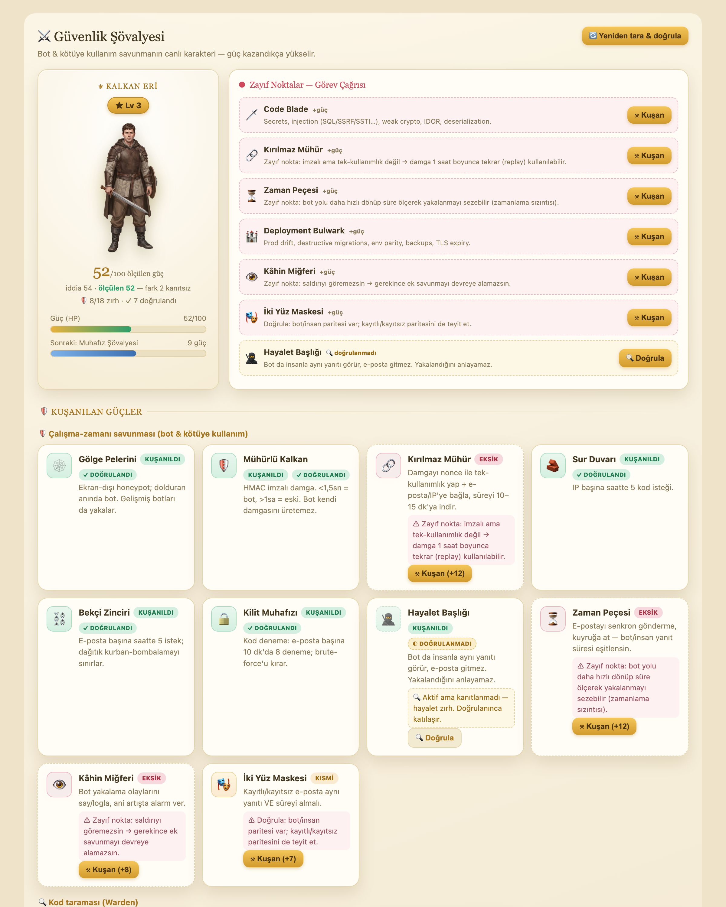

<div align="center">

# ⚔️ Warden

### Defend your codebase like a realm.

**Warden scans everything *missing, broken or risky* across your whole system — then arms a knight
that only levels up when a real re-scan proves the gap is truly closed.**
No green tick it hasn't earned. No fix that breaks your code. No move made in the dark.

[]()
[]()
[]()
[]()
[](CONTRIBUTING.md)

🇹🇷 [Türkçe README](docs/README.tr.md) · 📚 [Check catalog](docs/CHECKS.md) · ⚔️ [Warden Knight dashboard](security-knight/README.md) · 🛡️ [Security policy](SECURITY.md)



</div>

---

## 📜 The Warden's Oath

A security tool is only as good as the trust you can place in it. Warden makes **three promises —
and enforces all three in code**, not in the README:

| Vow | What it means | Enforced by |
|---|---|---|
| **I claim no victory I cannot prove.** | Posture is *measured*, never claimed. An armor piece turns solid **only** when a real, clean re-scan proves it — no button, endpoint or flag sets "active" directly. | content-based `fingerprint` + `computeDelta` before/after; the Knight bridge derives status from real findings only |
| **I mend without breaking the master's work.** | Automated fixes land with **zero damage**: a separate branch, your own test suite, fingerprint-delta verification, and a PR — *never* a direct commit to `main`. | `packages/warden-skill/SKILL.md` remediation procedure (git worktree isolation, delta gate, PR gate) |
| **I work in the open, never in the dark.** | Passive/read-only by default; every command and request is logged; active/DAST tests run **only** behind an explicit authorization gate. | `warden.authz.yml` gate · `warden-report/warden-run.log` audit trail · secret masking at the source |

> These aren't slogans — they're the invariants the test suite guards. Break one and CI goes red.

---

## Two parts, one guardian

**Scan → fix → arm up → re-scan.** The scanner finds weaknesses; the Knight turns fixing them
into leveling up a character — no claimed/manual state, only what a real re-scan proves.

| | 🛡️ **Warden Scan** _(engine, this repo root)_ | ⚔️ **Warden Knight** _([`security-knight/`](security-knight/README.md))_ |
|---|---|---|
| **What** | Static + dynamic security audit of any codebase | Live, gamified view of that same scan's posture |
| **Answers** | “What’s broken or risky in this code?” | “Which dimensions are actually clean — and what's left?” |
| **Form** | CLI / CI scanner → findings, SARIF, playbooks | Web panel + backend; "Equip" triggers a real re-scan |
| **Loop** | scan → remediation playbook → re‑scan (before/after delta) | equip → real findings → fix (yourself or an agent) → re-scan → level up |

<div align="center"></div>

> The two share one DNA — evidence‑based (measured, not claimed), authorization‑gated active
> testing, and a remediation loop. Scan tells you what to fix; the Knight shows the same truth,
> gamified, and never marks anything solid without a clean re-scan proving it.

### The Warden Knight dashboard

Your whole Warden scan posture (SAST, Cloud, Compliance, K8s, DAST, …) as one knight that arms up
as you fix real findings. A dimension Warden scanned clean is **solid** armor; a P0 dimension is a
**cracked** quest with the actual finding shown, not template text. Measured score (not claimed).

<div align="center"></div>

---

## ⛔ READ FIRST — Security & Authorization Principles (binding)

Warden has dual‑use capabilities (active/DAST tests). These rules are enforced **in code**:

1. **Passive / read‑only by default.** No active test ever runs unless explicitly enabled.
2. **Authorization Gate.** Active/DAST tests run *only* when a valid `warden.authz.yml` exists in the
   project root **and** contains:
   - `owner_attestation: true` — "I own these assets / I am authorized to test them"
   - `authorized_targets:` — allow‑list; active tests hit **only** these hosts/domains/IPs
   - `authorized_by:` and `date:` — audit trail

   Missing or incomplete file → Warden stays **passive**. No request ever leaves the allow‑list.
3. **Non‑intrusive.** Even active tests are rate‑limited, non‑destructive and low‑volume.
   **No DoS, no brute‑force, no exploitation, no detection evasion.**
4. **Secret masking at the source.** Any token/password/URL is written to reports as `***`;
   the full value is **never** serialized (report, JSON, SARIF, logs — all masked).
5. **Audit log.** Every command/request Warden runs is written to `warden-report/warden-run.log`.
6. **No production mutation.** Commands stay at inspect/diff/dry‑run level — no deploy/migrate/restart.

> Warden is for authorized self‑assessment, CTF, education and defense. Unauthorized use is prohibited
> and is the user's responsibility.

---

## 🛡️ Warden Scan — what it does

- **Module A — Parity & Deployment** (passive): git drift, destructive migrations (Prisma/Django/Laravel/EF Core/Go), runtime freshness, **generic volume‑parity engine**, `.env` ↔ `.env.example`, backup/restore + TLS expiry, external webhooks.
- **Module B — SAST** (passive): hardcoded secrets (+ provider keys & **entropy‑based** detection + **git‑history** scan), vulnerable dependencies (`npm/pnpm audit`), weak crypto (MD5/SHA1/ECB/CryptoJS), JWT‑in‑localStorage & **`alg:none`**, IDOR, SQL/command/eval injection, **SSRF · SSTI · path traversal · insecure deserialization · XXE · open redirect**, CORS, frontend XSS sinks + **weak CSP / prod source‑maps** — across **TS/JS, Python, PHP, C#, Go**.
- **Module Imports — external‑tool orchestrator** (passive): ingests any **SARIF 2.1.0** report (OpenGrep/Semgrep, Trivy, Gitleaks, Checkov, Nuclei) and **OSV‑Scanner** JSON from `warden-imports/`, normalizing them into Warden's finding model (auto‑routing each to the right dimension — IaC→CLOUD, K8s→K8S, DAST→C) so fingerprint/delta, scoring, playbook, waivers and SARIF re‑export apply to them too. With `WARDEN_TOOLS=all` (or a comma‑list) Warden **runs the installed engines directly** (OpenGrep/Semgrep/Trivy/Gitleaks/Checkov; `osv-scanner` live SCA), and gate‑restricted **Nuclei** for DAST — each skipped gracefully if absent.
- **Module D — Compliance** (passive): observability, secret management, CI/CD, data protection, plus **PCI‑DSS 4.0** (CVV/PAN scanning + checklist) and **Privacy / GDPR‑KVKK** checklist.
- **Module CLOUD** (passive, Terraform): public S3/GCS, IAM wildcards, open security groups/firewalls, public RDS/Cloud SQL, Azure public storage, Cloudflare SSL mode.
- **Module K8S** (passive): privileged/root containers, `:latest` images, plaintext secret env, ingress without TLS.
- **Module AI** (passive): embedded LLM API keys, prompt‑injection surface, system‑prompt leakage.
- **Module ACCESS — Access control & tenant isolation** (passive): the OWASP #1 gap that breaks SaaS/CRM/ERP — **multi‑tenant isolation** (object fetched by client id with no `tenant_id`/`org_id` scope → cross‑tenant leak), **missing endpoint authorization** (state‑changing route with no auth middleware while the rest of the app authenticates), **mass assignment / over‑posting** (`req.body` written straight to a model → `is_admin` escalation), and **privileged/admin actions without a role check**. Multi‑stack (Express/Nest, Django, Rails, Laravel; Prisma/Sequelize/TypeORM/Mongoose). Only runs when a web/API + ORM surface is detected.
- **Module AUTH — Identity & session hardening** (passive): account-takeover surface — **MFA/2FA absence**, **predictable password-reset tokens** (`Math.random`/`Date.now`), **insecure session cookies** (missing `httpOnly`/`secure`/`sameSite`), **JWT without expiry**, **login brute-force protection** (rate-limit/lockout), and **weak password policy** (hashing but no strength/pwned check). Absence checks scan comment-stripped code. Only runs when an auth surface is detected.
- **Module API — API security (OWASP API Top 10)** (passive): the API-specific gaps beyond ACCESS/injection — **excessive data exposure** (`SELECT *` / returning every column), **no rate limiting**, **unbounded queries** (`findMany`/`findAll` with no pagination → whole table), **verbose errors** (stack traces leaked to the client), and **GraphQL depth/complexity limits**. Only runs when an HTTP/API surface is detected.
- **Module PRIV — Data privacy & audit trail** (passive): the compliance layer for CRM/ERP holding personal data (KVKK/GDPR) — **PII in logs** (email/phone/national‑id/IBAN), **PII in URLs/query strings**, **high‑sensitive fields without at‑rest encryption**, **no erasure / right‑to‑be‑forgotten** mechanism, and **no audit trail** of who accessed/changed sensitive records. Only runs when PII fields are detected.
- **Module UPLOAD — File upload security** (passive): almost every SaaS/CRM/ERP accepts uploads — a classic high‑impact class. Flags **unrestricted file type** (no `fileFilter` / extension‑MIME whitelist → webshell, stored‑XSS), **path traversal via user filename** (`originalname` into an fs path without `path.basename` → write outside the upload dir), **missing size limit** (`limits.fileSize` absent → DoS / disk exhaustion), and **uploads stored under web‑root** (public/static → uploaded scripts served & executed). Only runs when an upload surface (multer/formidable/busboy/express‑fileupload…) is detected.
- **Module EMAIL — Email security** (passive): the statically‑detectable slice of email security — **email header injection** (user input into `from`/`replyTo`/`headers` → CRLF, hidden Bcc exfiltration, sender spoofing), **unescaped user input in HTML email bodies** (phishing / content injection), and **SMTP without TLS** (`secure:false`, port 25, `ignoreTLS`, `rejectUnauthorized:false` → credentials & content in the clear). Only runs when a mailer/SMTP surface is detected. *(SPF/DKIM/DMARC are DNS‑level records verified against a live domain — that belongs to the DAST layer, not static analysis.)*
- **Module FLOW — Workflow & data integrity** (passive): the reliability layer for CRM/ERP that touches money, stock or state — a generalization of PAY‑9 beyond payments. Flags **multi‑step DB writes without a transaction** (crash mid‑way → account debited but not credited, order created but stock not decremented), **non‑atomic read‑modify‑write** on counters/balances/stock (concurrent requests → lost update, oversell), and **non‑idempotent creation** of orders/transfers/reservations (double‑click / retry → duplicate records). Handler bodies are brace‑matched and evaluated per handler. Only runs when a web surface is detected.
- **Module WEB — CSRF, clickjacking & security headers** (passive): the static complement to Module B (CORS/XSS/CSP) and DAST (live headers) — notably **CSRF, which no other module covers**. Flags **missing CSRF protection** on cookie‑session state‑changing routes, **absent security headers** (helmet/X‑Frame‑Options/HSTS/CSP → clickjacking, SSL‑strip, MIME‑sniffing), and **reflected CORS origin with credentials** (`origin: req.origin` → any site gets authenticated access). Only runs when a web surface is detected.
- **Module PAY — Payment security & reliability** (passive): recognizes a payment integration (Stripe, PayPal, Braintree, Adyen, Razorpay, Mollie, iyzico, craftgate, PayU…) and audits the money path — **webhook signature verification** (forged “payment succeeded”), **client‑set amount** (price tampering), **idempotency** (double charge on retry), **card data (PAN/CVV) in logs/server**, **reconciliation (mutabakat) cron** presence, **orphan/interrupted payment** handling (charged‑but‑not‑fulfilled, uncaptured auths), **failed/async event** handling, **subscription dunning** (failed‑renewal recovery), **3DS/SCA** enforcement (legacy Charges API can’t do SCA), and **refund accounting** (client‑set refund amount → over‑refund). Only runs when a payment integration is detected.
- **Module C — DAST** (active, **authorization‑gated**): exposed files (`/.env`, `/.git`, swagger), security headers + TLS, open admin panels, rate‑limit probing, cookie flags, sensitive port inventory.

Every finding carries a **CVSS v4** base score + exploitability, standard mappings
(**OWASP Top 10 / ASVS / API / CIS Benchmark / ISO 27001:2022**), evidence (`file:line` or command), and a remediation prompt.
Findings that carry a CVE are additionally prioritized with **CISA KEV** (known‑exploited) and **EPSS** (30‑day exploit probability),
loaded **offline** from optional `warden-data/kev.json` / `warden-data/epss.json` snapshots (no network — passive by default),
and with **import‑level reachability** — a dependency that isn't in the source import graph (likely transitive) is de‑prioritized (unless it's KEV).

## Architecture

A pnpm monorepo, runs build‑free on Node 22 (`tsx`):

| Package | Responsibility |
|---------|----------------|
| `packages/warden-core` | Stack‑agnostic engine: finding model, authorization gate, detectors, modules, report generator, risk engine, secret masking, audit log. |
| `packages/warden-cli`  | `warden init · scan · pentest · report · monitor`. |
| `packages/warden-skill`| Claude Code Skill bridge (`SKILL.md`). Cursor / Windsurf / VS Code / GitHub Actions also consume the core. |

## Quick start

```bash
pnpm install

# Passive audit (default; never sends an active request)
pnpm warden scan --target <path-to-project>

# Install Warden into a project as a Claude Code skill — also copies the Warden Knight
# dashboard into that project and opens it in your browser (pass --no-launch to skip that)
pnpm warden init --target <path-to-project>

# Continuous monitoring (periodic re-scan + before/after delta)
pnpm warden monitor --target <path> --interval 1800

# Active/DAST — only after opening the authorization gate
cp warden.authz.example.yml warden.authz.yml   # fill in owner_attestation / authorized_targets / authorized_by / date
pnpm warden pentest --target <path>
```

### Output (`warden-report/`)

| File | Contents |
|------|----------|
| `report.md` | Executive summary, scoreboard, before/after delta, severity‑ranked findings |
| `findings.json` | Machine‑readable (CI gate); stable `id` + `fingerprint`, scoreboard, checklists, delta |
| `findings.sarif` | SARIF 2.1.0 → GitHub Code Scanning / Azure DevOps |
| `remediation-playbook.md` | Copy‑paste **Claude Code prompt** per P0/P1 (risk · standard · locations · steps · acceptance) |
| `parity-report.md` | Module A layer table + **Parity Risk Score** |
| `compliance-report.md` | PCI‑DSS / Privacy / OWASP ASVS / CIS / ISO 27001 checklists (✔/⚠/✖/–) |
| `history.jsonl` | Per‑run trend for the delta engine |
| `warden-run.log` | Audit trail of every command/request |

Severity: **P0** (production blocker / actively exploitable) · **P1** (before first customer) · **P2** (architectural debt) · **P3** (scale/polish).

### Launch the gamified dashboard

```bash
pnpm knight   # → opens the Warden Knight panel in your browser automatically
```

Run a scan (`pnpm warden scan`) first so there's something to arm up. From then on, everything —
re-scanning, equipping an armor piece (which triggers a real scan and shows real findings), queuing
a fix for an agent, watching the knight level up — happens from the panel itself; no need to come
back to the terminal.

That runs the dashboard against **this repo**. To point this same running panel at a *different*
project without installing anything into it, set `WARDEN_TARGET`:

```bash
WARDEN_TARGET=/abs/path/to/other-project pnpm knight
```

To install a dedicated, self-contained copy of the panel *inside* a project you actively harden
(so its own `pnpm warden scan --target .` needs no env var, and its own Claude Code session can run
the parallel-agent remediation procedure), use `warden init` instead — see above.

See [`security-knight/README.md`](security-knight/README.md) for the full picture.

## The value loop

```
warden init  →  scan  →  hand remediation-playbook.md prompts to an agent  →  fix  →  re-scan
                                                                                        │
            before/after delta proves what got fixed, what's new, what remains  ◀───────┘
```

## CI / GitHub Action

Warden ships a composite action (`action.yml`) that runs a passive scan and uploads SARIF:

```yaml
permissions:
  contents: read
  security-events: write   # required for SARIF upload
jobs:
  warden:
    runs-on: ubuntu-latest
    steps:
      - uses: actions/checkout@v4
      - uses: <org>/warden@v1
        with:
          target: "."
          fail-on: "P0"          # fail the job on any P0 finding
          upload-sarif: "true"   # findings.sarif → Code Scanning
```

Local equivalent of the gate: `warden scan --fail-on P0` (exit code 1 on P0+).

### Suppressing false positives (`.warden-ignore.yml`)

False positives can be waived with a justification in a `.warden-ignore.yml` at the project root.
Waived findings are dropped from the report **and** the `--fail-on` gate, but never hidden silently:
each applied waiver is written to the audit log and the CLI summary. Selectors (`fingerprint` /
`check` / `id`) match with AND semantics, and every entry requires a `reason`:

```yaml
waivers:
  - fingerprint: "a1b2c3d4e5f6..."   # most stable; binds to a finding's content hash
    reason: "Reviewed — intentional, not a real issue."
  - check: "B3"                       # broader; all B3 findings
    reason: "SHA1 used only for content fingerprinting, not security."
    expires: "2026-12-31"             # optional; past this date the waiver is inactive
```

## Supported stacks

**Languages/frameworks:** Node/TypeScript (Prisma, Drizzle, Express, Next, NestJS), Python/Django, PHP/Laravel, .NET/ASP.NET (EF Core), Go.
**Infra:** Docker/Compose, Kubernetes manifests, Terraform (AWS/Azure/GCP/Cloudflare).
Adding a stack = one `StackDetector` + optional schema analyzer + declarative SAST rules.

## Status

Actively developed. 278 tests passing; 19 vulnerable‑by‑design fixtures + a safe‑by‑design fixture (false‑positive guard).
See [`docs/CHECKS.md`](docs/CHECKS.md) for the full, per‑check status catalog.

Ideas, checks for new stacks, and bug reports are all welcome — see [`CONTRIBUTING.md`](CONTRIBUTING.md).
Found a vulnerability *in Warden itself*? Please follow [`SECURITY.md`](SECURITY.md) (private disclosure).

## License

MIT
