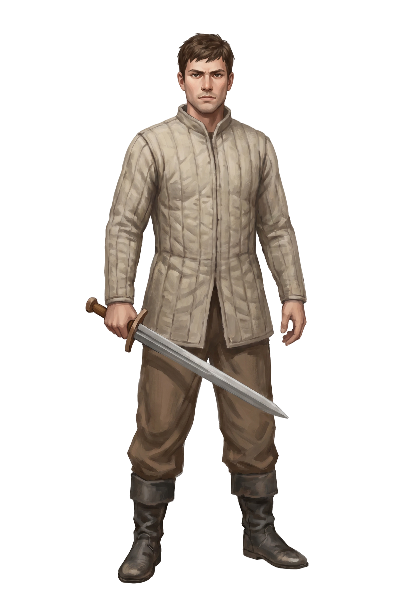
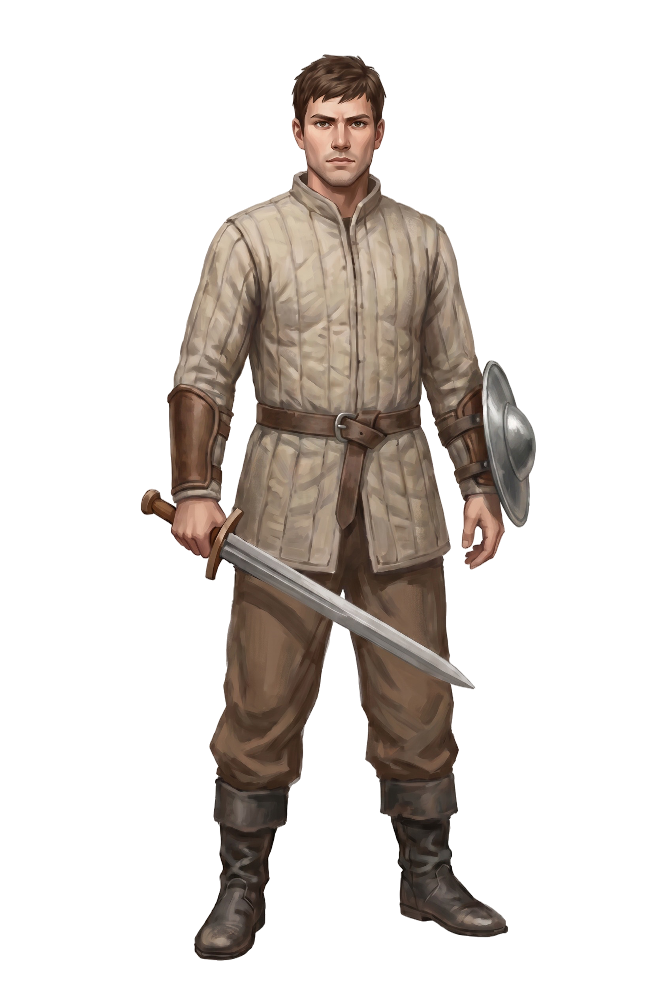
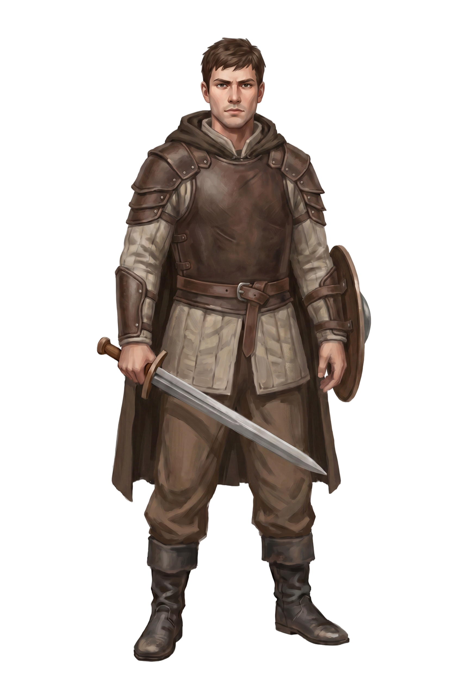
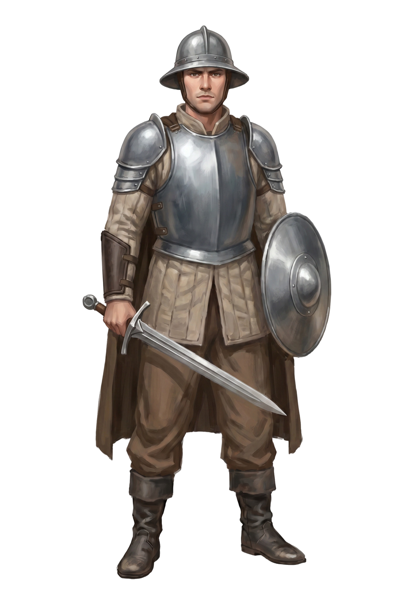
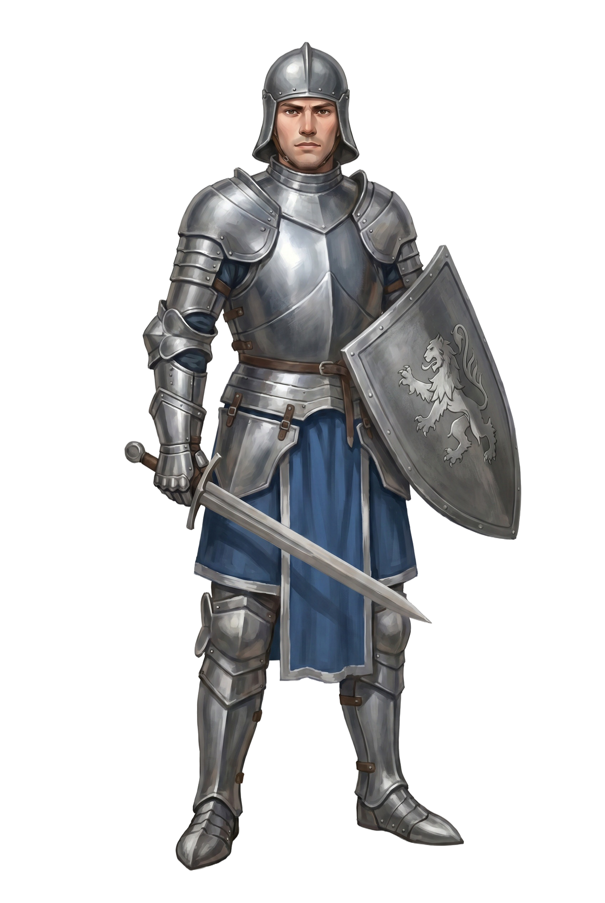

<div align="center">

# ⚔️ Warden Knight <sub>(Security Knight)</sub>

> Part of the **[Warden](../README.md)** security platform — the live, gamified dashboard.
> _Warden Scan finds what to fix; the Knight proves your defenses hold._

### Your project's real Warden-scan posture — a knight that arms up as you fix real findings.

**A gamified, _measured_ security-posture dashboard.** Every Warden scan dimension (SAST, Cloud,
Compliance, K8s, DAST, …) is a piece of armor. Equip and _fix_ it, and your knight grows from a
plain recruit into a fully-armored champion. Miss one, and the panel raises the alarm — showing
you the actual bulgu, not a canned checklist.


[]()
[]()
[]()
[]()

</div>

---

## The idea

Security dashboards usually show what you _claim_ is protected — a checklist of green ticks that
quietly lie the moment reality drifts. **Security Knight shows what's actually _measured_.**

Each armor piece = a real Warden scan dimension. The knight's power comes from real signals — an
actual `pnpm warden scan` of your actual code, not a flag someone flipped. A dimension with open
P0/P1 findings is a **cracked, weak** piece of armor with a live quest ("here's exactly what's
wrong, here's the fix"). A dimension Warden scanned clean turns **solid, verified** armor.

> It can't show a green tick it hasn't earned.

<div align="center"></div>

## The knight grows as you harden

The character is generated art (via Magnific / Nano Banana Pro) — one consistent hero across a
6-stage progression. Your measured score picks the stage:

| Lv 1 | Lv 2 | Lv 3 | Lv 4 | Lv 5 | Lv 6 |
|:---:|:---:|:---:|:---:|:---:|:---:|
|  |  |  |  |  |  |
| Gambeson recruit | + leather & buckler | + leather cuirass | + steel plate & helm | + full plate & shield | Legendary champion |

## Features

- 🛡️ **Measured posture, not claimed** — power derives from a real `pnpm warden scan`, not a flag.
- 🔎 **Real findings on click** — "Equip" triggers a live scan; the drawer shows the actual
  severity/file:line/recommendation for that dimension, not template text.
- 🤖 **Parallel-agent remediation** — "Queue for the agent" fans out independent findings to
  sub-agents (`packages/warden-skill/SKILL.md`'s procedure), verifies via fingerprint delta, opens a PR.
- 🔒 **Never faked** — armor only turns `active` via a real, clean re-scan (`warden-bridge.mjs`);
  nothing writes "active" directly. Merging a fix doesn't auto-arm the knight — re-scan `main` does.
- 🧩 **Framework-agnostic & zero-dependency** — drop the ES-module widget into any app.
- 🌉 **One bridge, whole codebase** — `warden-bridge.mjs` maps Warden's entire scoreboard (A/B/C/D/
  CLOUD/K8S/FE/AI/PAY) onto the same knight widget, no per-dimension custom code.

## Real-scan "Equip"

Clicking an armor piece no longer just queues an abstract job — it triggers a real, live scan and
shows the actual findings:

1. Click an armor piece → the panel immediately `POST`s `/api/warden/scan` (a real `pnpm warden
   scan`, then `warden-bridge.mjs` refreshes the whole board) and polls `GET /api/warden/gaps?module=<key>`
   until the fresh findings for that dimension arrive.
2. The drawer shows the **real** findings (severity, file:line, recommendation) — not template text.
3. Two choices: **"🔧 Fix it myself"** (copies the exact `warden prompts --module <key> ...` command
   / points at `remediation-playbook.md`) or **"🤖 Queue for the agent"** (`POST /api/warden/fix-queue`
   — an agent, per `packages/warden-skill/SKILL.md`'s "Otomatik Düzeltme Prosedürü", fans out
   parallel sub-agents for independent findings, verifies via fingerprint delta, opens a PR).
4. The armor only ever turns `active` via a real, clean re-scan (`warden-bridge.mjs`) — never a
   direct status write. Merging a fix doesn't auto-arm the knight; re-run the loop against `main`.

`warden-equip.mjs` is the script behind this: `--module <key>` (full scan + write
`state/warden-gaps/<key>.json`, used by "Equip") vs. `--module <key> --queue` (fast path — no
rescan, just reads the existing findings via `warden prompts` and writes the job immediately, so
the panel's "processing" indicator never races with a slow scan).

## Quick start

```bash
cp .env.example .env          # set SK_ADMIN_TOKEN (optional; dev-open on localhost without it)
node server.mjs               # → opens http://127.0.0.1:8137/ in your browser
# or, from the repo root: pnpm knight
```

The panel is the entry point from here on — "Equip", "queue for the agent", "re-scan", everything
happens by clicking in the browser. No need to come back to the terminal. Set `SK_NO_OPEN=1` to
disable the auto-open (e.g. in a headless/CI environment).

Feed it a scan directly (or let "Equip"/the loop button do it for you):

```bash
pnpm warden scan --target <project>                            # → warden-report/findings.json
node warden-bridge.mjs --file ../warden-report/findings.json    # → state/warden-posture.json
```

## Two ways to install

- **Per-project (recommended for the full loop):** `pnpm warden init --target <project>` — copies
  this panel into `<project>/security-knight/` (and the Claude Code skill into
  `<project>/.claude/skills/warden/`), then immediately starts the panel and opens it in your
  browser. The copied panel's own `pnpm warden scan --target .` always targets that project — no
  env var needed, since it's now physically inside it. Pass `--no-launch` to copy without starting
  it (e.g. in CI), or `--no-panel` to install only the skill (old behavior).
- **Central, pointed at another project:** keep this repo as-is and set `WARDEN_TARGET=/abs/path/to/project`
  (in `.env`, or inline: `WARDEN_TARGET=/path/to/project node server.mjs`) — every scan/gaps/fix-queue
  request targets that path instead of this repo's own parent directory. Useful for a single
  "fleet dashboard" you point at whichever project you're currently hardening, without installing
  anything into it. `state/warden-gaps/` and `warden-report/` still land wherever the scan ran
  (the target project's own tree for the scan output; this panel's own `state/` for the gaps cache).

## How it works

```
 Panel "Equip"  →  POST /api/warden/scan  →  real pnpm warden scan  →  warden-bridge.mjs
                                                                            │
                                                          state/warden-gaps/<module>.json
                                                          (drawer shows REAL findings)
                                                                            │
                        "🔧 Fix it myself" ◄───────────────┬───────────────► "🤖 Queue for the agent"
                                                            │                        │
                                                            │           POST /api/warden/fix-queue
                                                            │                        │
                                                            │              SKILL.md procedure:
                                                            │        parallel sub-agents → fix → verify
                                                            │         (fingerprint delta) → open PR
                                                            │                        │
                                                            └──────────► merge → re-scan `main`
                                                                                     │
                                                                    warden-bridge.mjs re-derives status
                                                                                     ▼
                                                        Panel re-reads posture → armor turns solid,
                                                                the knight levels up
```

- **Measured score** = Σ(weight × factor), one factor per dimension: `active`+verified 1.0 ·
  `partial` (P1/low score) 0.6 · `open` (P0 present) 0 · `optional` (not evaluated) 0.
- A dimension can only reach `active` through `warden-bridge.mjs` reading a genuinely clean scan —
  there's no button, endpoint, or manual override that sets it directly.

## Files

| File | Role |
|---|---|
| `index.html` · `knight.js` · `knight.css` | The widget (zero-dependency ES module). |
| `posture-warden.js` | Armor registry — one entry per Warden scan module (A/B/C/D/CLOUD/K8S/FE/AI/PAY). |
| `warden-bridge.mjs` | Reads `findings.json` → writes `state/warden-posture.json` (scan → armor). |
| `warden-equip.mjs` | Backs the "Equip" flow — real scan + gaps file, or fast queue-only path. |
| `loop.mjs` | Full cycle: scan → bridge, one command (used by the "re-scan" button). |
| `server.mjs` | Local dev backend: posture / scan / gaps / fix-queue / job queue + auth + audit. |
| `assets/knight-lv1..6.png` | Generated knight art (the progression stages). |
| `api-example/*.ts` | Production Next.js route sketch — `/api/warden/*` routes, file-store + Redis-store variants, serverless-vs-CI-triggered scan caveat. |
| `GO-LIVE.md` | Production checklist — auth, HTTPS, PR gate, serverless scan caveat. |

## Integrate (Next.js / React)

```tsx
"use client";
import { useEffect, useRef } from "react";
export default function SecurityKnight() {
  const ref = useRef<HTMLDivElement>(null);
  useEffect(() => {
    (async () => {
      const [{ mountSecurityKnight }, { WARDEN_POSTURE }] = await Promise.all([
        import("@/security-knight/knight.js"),
        import("@/security-knight/posture-warden.js"),
      ]);
      mountSecurityKnight(ref.current!, { posture: WARDEN_POSTURE, endpoint: "/api/warden/posture", mode: "live", pollMs: 5000 });
    })();
  }, []);
  return <div ref={ref} />;
}
```

Put the panel + its API behind admin authentication in production — `server.mjs` is a **local dev**
bridge only (see the file header). See `GO-LIVE.md` for the fuller checklist.

## Security & scope

- Scanning is **passive/read-only by default** (Warden's own authz gate — see root README);
  active/DAST checks only run when a project explicitly opens `warden.authz.yml`.
- Backend endpoints require auth (`SK_ADMIN_TOKEN`, dev-open on localhost without it).
- Remediation always lands via branch + PR (never a direct commit to `main`) — see
  `packages/warden-skill/SKILL.md`'s "Otomatik Düzeltme Prosedürü".
- This tool is for **authorized self-assessment and defense**.

## Roadmap

- [x] Measured posture, driven entirely by real Warden scans (no claimed/manual state)
- [x] Real findings in the "Equip" drawer, not template quest text
- [x] Parallel-agent remediation procedure (fingerprint-verified, PR-gated)
- [x] `api-example/` + `GO-LIVE.md` updated to the `/api/warden/*` routes
- [ ] Multi-endpoint fronts (one knight per protected route/service)
- [ ] Per-module fast re-verify (scoped scan without corrupting the other dimensions' scores)
- [ ] CI-triggered scan path for serverless deploys (the `triggerScanViaCi` sketch in `nextjs-routes.ts` is unimplemented)

> UI strings are currently Turkish (i18n-ready); the engine and API are language-neutral.

## License

MIT
